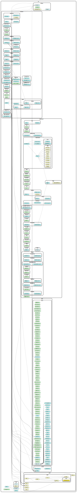

#  NFT Emporium

## Overview

## API

Components
----------

**src/assets/icons/Accessories.tsx**

### 1. Accessories

Property | Type | Required | Default value | Description
:--- | :--- | :--- | :--- | :---
color||no|&lt;See the source code&gt;|
width||no|&lt;See the source code&gt;|
height||no|&lt;See the source code&gt;|
-----
**src/assets/icons/AdobeIcon.tsx**

### 1. AdobeIcon

Property | Type | Required | Default value | Description
:--- | :--- | :--- | :--- | :---
width||no|&lt;See the source code&gt;|
height||no|&lt;See the source code&gt;|
color||no|&lt;See the source code&gt;|
-----
**src/assets/icons/AlertDotIcon.tsx**

### 1. AlertDotIcon

-----
**src/assets/icons/ArrowDown.tsx**

### 1. ArrowDown

Property | Type | Required | Default value | Description
:--- | :--- | :--- | :--- | :---
color||no|&lt;See the source code&gt;|
width||no|&lt;See the source code&gt;|
height||no|&lt;See the source code&gt;|
-----
**src/assets/icons/ArrowDropDown.tsx**

### 1. ArrowDropDown

-----
**src/assets/icons/ArrowLeftRound.tsx**

### 1. ArrowLeftRound

Property | Type | Required | Default value | Description
:--- | :--- | :--- | :--- | :---
color||no|&lt;See the source code&gt;|
width||no|&lt;See the source code&gt;|
height||no|&lt;See the source code&gt;|
-----
**src/assets/icons/ArrowNext.tsx**

### 1. ArrowNext

-----
**src/assets/icons/ArrowPrev.tsx**

### 1. ArrowPrev

-----
**src/assets/icons/ArrowUp.tsx**

### 1. ArrowUp

Property | Type | Required | Default value | Description
:--- | :--- | :--- | :--- | :---
color||no|&lt;See the source code&gt;|
width||no|&lt;See the source code&gt;|
height||no|&lt;See the source code&gt;|
-----
**src/assets/icons/BathOil.tsx**

### 1. BathOil

Property | Type | Required | Default value | Description
:--- | :--- | :--- | :--- | :---
color||no|&lt;See the source code&gt;|
width||no|&lt;See the source code&gt;|
height||no|&lt;See the source code&gt;|
-----
**src/assets/icons/BeautyHealth.tsx**

### 1. BeautyHealth

Property | Type | Required | Default value | Description
:--- | :--- | :--- | :--- | :---
color||no|&lt;See the source code&gt;|
width||no|&lt;See the source code&gt;|
height||no|&lt;See the source code&gt;|
-----
**src/assets/icons/Beverage.tsx**

### 1. Beverage

Property | Type | Required | Default value | Description
:--- | :--- | :--- | :--- | :---
color||no|&lt;See the source code&gt;|
width||no|&lt;See the source code&gt;|
height||no|&lt;See the source code&gt;|
-----
**src/assets/icons/BookIcon.tsx**

### 1. BookIcon

Property | Type | Required | Default value | Description
:--- | :--- | :--- | :--- | :---
width||no|&lt;See the source code&gt;|
height||no|&lt;See the source code&gt;|
color||no|&lt;See the source code&gt;|
-----
**src/assets/icons/Breakfast.tsx**

### 1. Breakfast

Property | Type | Required | Default value | Description
:--- | :--- | :--- | :--- | :---
color||no|&lt;See the source code&gt;|
width||no|&lt;See the source code&gt;|
height||no|&lt;See the source code&gt;|
-----
**src/assets/icons/CNFlag.tsx**

### 1. CNFlag

Property | Type | Required | Default value | Description
:--- | :--- | :--- | :--- | :---
width||no|&lt;See the source code&gt;|
height||no|&lt;See the source code&gt;|
-----
**src/assets/icons/CaretDownIcon.tsx**

### 1. CaretDownIcon

-----
**src/assets/icons/CaretUpIcon.tsx**

### 1. CaretUpIcon

-----
**src/assets/icons/CartIcon.tsx**

### 1. CartIcon

-----
**src/assets/icons/CartIconBig.tsx**

### 1. CartIconBig

Property | Type | Required | Default value | Description
:--- | :--- | :--- | :--- | :---
width||no|&lt;See the source code&gt;|
height||no|&lt;See the source code&gt;|
-----
**src/assets/icons/CategoryIcon.tsx**

### 1. CategoryIcon

-----
**src/assets/icons/CheckMark.tsx**

### 1. CheckMark

-----
**src/assets/icons/CloseIcon.tsx**

### 1. CloseIcon

-----
**src/assets/icons/CloseSquare.tsx**

### 1. CloseSquareO

-----
**src/assets/icons/CoinIcon.tsx**

### 1. CoinIcon

Property | Type | Required | Default value | Description
:--- | :--- | :--- | :--- | :---
width||no|&lt;See the source code&gt;|
height||no|&lt;See the source code&gt;|
-----
**src/assets/icons/Cooking.tsx**

### 1. Cooking

Property | Type | Required | Default value | Description
:--- | :--- | :--- | :--- | :---
color||no|&lt;See the source code&gt;|
width||no|&lt;See the source code&gt;|
height||no|&lt;See the source code&gt;|
-----
**src/assets/icons/CouponIcon.tsx**

### 1. CouponIcon

Property | Type | Required | Default value | Description
:--- | :--- | :--- | :--- | :---
width||no|&lt;See the source code&gt;|
height||no|&lt;See the source code&gt;|
-----
**src/assets/icons/CustomerIcon.tsx**

### 1. CustomerIcon

-----
**src/assets/icons/DEFlag.tsx**

### 1. DEFlag

Property | Type | Required | Default value | Description
:--- | :--- | :--- | :--- | :---
width||no|&lt;See the source code&gt;|
height||no|&lt;See the source code&gt;|
-----
**src/assets/icons/Dairy.tsx**

### 1. Dairy

Property | Type | Required | Default value | Description
:--- | :--- | :--- | :--- | :---
color||no|&lt;See the source code&gt;|
width||no|&lt;See the source code&gt;|
height||no|&lt;See the source code&gt;|
-----
**src/assets/icons/DashboardIcon.tsx**

### 1. DashboardIcon

-----
**src/assets/icons/DeliveryIcon.tsx**

### 1. DeliveryIcon

Property | Type | Required | Default value | Description
:--- | :--- | :--- | :--- | :---
width||no|&lt;See the source code&gt;|
height||no|&lt;See the source code&gt;|
-----
**src/assets/icons/Deodorant.tsx**

### 1. Deodorant

Property | Type | Required | Default value | Description
:--- | :--- | :--- | :--- | :---
color||no|&lt;See the source code&gt;|
width||no|&lt;See the source code&gt;|
height||no|&lt;See the source code&gt;|
-----
**src/assets/icons/DressIcon.tsx**

### 1. DressIcon

-----
**src/assets/icons/ESFlag.tsx**

### 1. ESFlag

Property | Type | Required | Default value | Description
:--- | :--- | :--- | :--- | :---
width||no|&lt;See the source code&gt;|
height||no|&lt;See the source code&gt;|
-----
**src/assets/icons/EllipsisIcon.tsx**

### 1. EllipsisIcon

-----
**src/assets/icons/Eyes.tsx**

### 1. Eyes

Property | Type | Required | Default value | Description
:--- | :--- | :--- | :--- | :---
color||no|&lt;See the source code&gt;|
width||no|&lt;See the source code&gt;|
height||no|&lt;See the source code&gt;|
-----
**src/assets/icons/Face.tsx**

### 1. Face

Property | Type | Required | Default value | Description
:--- | :--- | :--- | :--- | :---
color||no|&lt;See the source code&gt;|
width||no|&lt;See the source code&gt;|
height||no|&lt;See the source code&gt;|
-----
**src/assets/icons/Facebook.tsx**

### 1. Facebook

Property | Type | Required | Default value | Description
:--- | :--- | :--- | :--- | :---
color||no|&lt;See the source code&gt;|
width||no|&lt;See the source code&gt;|
height||no|&lt;See the source code&gt;|
-----
**src/assets/icons/FacialCare.tsx**

### 1. FacialCare

Property | Type | Required | Default value | Description
:--- | :--- | :--- | :--- | :---
color||no|&lt;See the source code&gt;|
width||no|&lt;See the source code&gt;|
height||no|&lt;See the source code&gt;|
-----
**src/assets/icons/FruitsVegetable.tsx**

### 1. FruitsVegetable

Property | Type | Required | Default value | Description
:--- | :--- | :--- | :--- | :---
color||no|&lt;See the source code&gt;|
width||no|&lt;See the source code&gt;|
height||no|&lt;See the source code&gt;|
-----
**src/assets/icons/FurnitureIcon.tsx**

### 1. FurnitureIcon

Property | Type | Required | Default value | Description
:--- | :--- | :--- | :--- | :---
width||no|&lt;See the source code&gt;|
height||no|&lt;See the source code&gt;|
color||no|&lt;See the source code&gt;|
-----
**src/assets/icons/GiftBox.tsx**

### 1. GiftBox

-----
**src/assets/icons/Google.tsx**

### 1. Google

Property | Type | Required | Default value | Description
:--- | :--- | :--- | :--- | :---
color||no|&lt;See the source code&gt;|
width||no|&lt;See the source code&gt;|
height||no|&lt;See the source code&gt;|
-----
**src/assets/icons/GooglePlus.tsx**

### 1. GooglePlus

Property | Type | Required | Default value | Description
:--- | :--- | :--- | :--- | :---
color||no|&lt;See the source code&gt;|
width||no|&lt;See the source code&gt;|
height||no|&lt;See the source code&gt;|
-----
**src/assets/icons/GroceryIcon.tsx**

### 1. GroceryIcon

-----
**src/assets/icons/HandBags.tsx**

### 1. HandBags

Property | Type | Required | Default value | Description
:--- | :--- | :--- | :--- | :---
color||no|&lt;See the source code&gt;|
width||no|&lt;See the source code&gt;|
height||no|&lt;See the source code&gt;|
-----
**src/assets/icons/Handbag.tsx**

### 1. Handbag

-----
**src/assets/icons/HelpIcon.tsx**

### 1. HelpIcon

Property | Type | Required | Default value | Description
:--- | :--- | :--- | :--- | :---
color||no|&lt;See the source code&gt;|
width||no|&lt;See the source code&gt;|
height||no|&lt;See the source code&gt;|
-----
**src/assets/icons/HomeCleaning.tsx**

### 1. HomeCleaning

Property | Type | Required | Default value | Description
:--- | :--- | :--- | :--- | :---
color||no|&lt;See the source code&gt;|
width||no|&lt;See the source code&gt;|
height||no|&lt;See the source code&gt;|
-----
**src/assets/icons/ILFlag.tsx**

### 1. ILFlag

Property | Type | Required | Default value | Description
:--- | :--- | :--- | :--- | :---
width||no|&lt;See the source code&gt;|
height||no|&lt;See the source code&gt;|
-----
**src/assets/icons/InboxIcon.tsx**

### 1. InboxIcon

-----
**src/assets/icons/InkPen.tsx**

### 1. InkPen

Property | Type | Required | Default value | Description
:--- | :--- | :--- | :--- | :---
width||no|&lt;See the source code&gt;|
height||no|&lt;See the source code&gt;|
color||no|&lt;See the source code&gt;|
-----
**src/assets/icons/IosArrowDown.tsx**

### 1. IosArrowDown

Property | Type | Required | Default value | Description
:--- | :--- | :--- | :--- | :---
color||no|&lt;See the source code&gt;|
width||no|&lt;See the source code&gt;|
height||no|&lt;See the source code&gt;|
-----
**src/assets/icons/IosArrowUp.tsx**

### 1. IosArrowUp

Property | Type | Required | Default value | Description
:--- | :--- | :--- | :--- | :---
color||no|&lt;See the source code&gt;|
width||no|&lt;See the source code&gt;|
height||no|&lt;See the source code&gt;|
-----
**src/assets/icons/LaptopBags.tsx**

### 1. LaptopBags

Property | Type | Required | Default value | Description
:--- | :--- | :--- | :--- | :---
color||no|&lt;See the source code&gt;|
width||no|&lt;See the source code&gt;|
height||no|&lt;See the source code&gt;|
-----
**src/assets/icons/Linkedin.tsx**

### 1. Linkedin

Property | Type | Required | Default value | Description
:--- | :--- | :--- | :--- | :---
width||no|&lt;See the source code&gt;|
height||no|&lt;See the source code&gt;|
color||no|&lt;See the source code&gt;|
-----
**src/assets/icons/Lips.tsx**

### 1. Lips

Property | Type | Required | Default value | Description
:--- | :--- | :--- | :--- | :---
color||no|&lt;See the source code&gt;|
width||no|&lt;See the source code&gt;|
height||no|&lt;See the source code&gt;|
-----
**src/assets/icons/LockIcon.tsx**

### 1. LockIcon

-----
**src/assets/icons/LogoutIcon.tsx**

### 1. LogoutIcon

-----
**src/assets/icons/LongArrowLeft.tsx**

### 1. LongArrowLeft

-----
**src/assets/icons/MakeupIcon.tsx**

### 1. MakeupIcon

-----
**src/assets/icons/MeatFish.tsx**

### 1. MeatFish

Property | Type | Required | Default value | Description
:--- | :--- | :--- | :--- | :---
color||no|&lt;See the source code&gt;|
width||no|&lt;See the source code&gt;|
height||no|&lt;See the source code&gt;|
-----
**src/assets/icons/MedicineIcon.tsx**

### 1. MedicineIcon

Property | Type | Required | Default value | Description
:--- | :--- | :--- | :--- | :---
width||no|&lt;See the source code&gt;|
height||no|&lt;See the source code&gt;|
color||no|&lt;See the source code&gt;|
-----
**src/assets/icons/Members.tsx**

### 1. Members

Property | Type | Required | Default value | Description
:--- | :--- | :--- | :--- | :---
color||no|&lt;See the source code&gt;|
width||no|&lt;See the source code&gt;|
height||no|&lt;See the source code&gt;|
-----
**src/assets/icons/MenuDown.tsx**

### 1. MenuDown

Property | Type | Required | Default value | Description
:--- | :--- | :--- | :--- | :---
color||no|&lt;See the source code&gt;|
width||no|&lt;See the source code&gt;|
height||no|&lt;See the source code&gt;|
-----
**src/assets/icons/MenuIcon.tsx**

### 1. MenuIcon

Property | Type | Required | Default value | Description
:--- | :--- | :--- | :--- | :---
color||no|&lt;See the source code&gt;|
width||no|&lt;See the source code&gt;|
height||no|&lt;See the source code&gt;|
-----
**src/assets/icons/MinusSquare.tsx**

### 1. MinusSquareO

-----
**src/assets/icons/NotificationIcon.tsx**

### 1. NotificationIcon

-----
**src/assets/icons/OptionIcon.tsx**

### 1. OptionIcon

-----
**src/assets/icons/OralCare.tsx**

### 1. OralCare

Property | Type | Required | Default value | Description
:--- | :--- | :--- | :--- | :---
color||no|&lt;See the source code&gt;|
width||no|&lt;See the source code&gt;|
height||no|&lt;See the source code&gt;|
-----
**src/assets/icons/OrderIcon.tsx**

### 1. OrderIcon

Property | Type | Required | Default value | Description
:--- | :--- | :--- | :--- | :---
width||no|&lt;See the source code&gt;|
height||no|&lt;See the source code&gt;|
-----
**src/assets/icons/OuterWear.tsx**

### 1. OuterWear

Property | Type | Required | Default value | Description
:--- | :--- | :--- | :--- | :---
color||no|&lt;See the source code&gt;|
width||no|&lt;See the source code&gt;|
height||no|&lt;See the source code&gt;|
-----
**src/assets/icons/Pants.tsx**

### 1. Pants

Property | Type | Required | Default value | Description
:--- | :--- | :--- | :--- | :---
color||no|&lt;See the source code&gt;|
width||no|&lt;See the source code&gt;|
height||no|&lt;See the source code&gt;|
-----
**src/assets/icons/PencilIcon.tsx**

### 1. PencilIcon

-----
**src/assets/icons/PetCare.tsx**

### 1. PetCare

Property | Type | Required | Default value | Description
:--- | :--- | :--- | :--- | :---
color||no|&lt;See the source code&gt;|
width||no|&lt;See the source code&gt;|
height||no|&lt;See the source code&gt;|
-----
**src/assets/icons/Plus.tsx**

### 1. Plus

Property | Type | Required | Default value | Description
:--- | :--- | :--- | :--- | :---
color||no|&lt;See the source code&gt;|
width||no|&lt;See the source code&gt;|
height||no|&lt;See the source code&gt;|
-----
**src/assets/icons/PlusMinus.tsx**

### 1. Plus

Property | Type | Required | Default value | Description
:--- | :--- | :--- | :--- | :---
color||no|&lt;See the source code&gt;|
width||no|&lt;See the source code&gt;|
height||no|&lt;See the source code&gt;|
### 2. Minus

Property | Type | Required | Default value | Description
:--- | :--- | :--- | :--- | :---
color||no|&lt;See the source code&gt;|
width||no|&lt;See the source code&gt;|
height||no|&lt;See the source code&gt;|
-----
**src/assets/icons/PlusOutline.tsx**

### 1. PlusOutline

Property | Type | Required | Default value | Description
:--- | :--- | :--- | :--- | :---
color||no|&lt;See the source code&gt;|
width||no|&lt;See the source code&gt;|
height||no|&lt;See the source code&gt;|
-----
**src/assets/icons/PlusSquare.tsx**

### 1. PlusSquareO

-----
**src/assets/icons/ProductIcon.tsx**

### 1. ProductIcon

Property | Type | Required | Default value | Description
:--- | :--- | :--- | :--- | :---
width||no|&lt;See the source code&gt;|
height||no|&lt;See the source code&gt;|
-----
**src/assets/icons/Purse.tsx**

### 1. Purse

Property | Type | Required | Default value | Description
:--- | :--- | :--- | :--- | :---
color||no|&lt;See the source code&gt;|
width||no|&lt;See the source code&gt;|
height||no|&lt;See the source code&gt;|
-----
**src/assets/icons/Refund.tsx**

### 1. Refund

Property | Type | Required | Default value | Description
:--- | :--- | :--- | :--- | :---
color||no|&lt;See the source code&gt;|
width||no|&lt;See the source code&gt;|
height||no|&lt;See the source code&gt;|
-----
**src/assets/icons/RefundIcon.tsx**

### 1. RefundIcon

-----
**src/assets/icons/Restaurant.tsx**

### 1. Restaurant

Property | Type | Required | Default value | Description
:--- | :--- | :--- | :--- | :---
color||no|&lt;See the source code&gt;|
width||no|&lt;See the source code&gt;|
height||no|&lt;See the source code&gt;|
-----
**src/assets/icons/Revenue.tsx**

### 1. Revenue

Property | Type | Required | Default value | Description
:--- | :--- | :--- | :--- | :---
color||no|&lt;See the source code&gt;|
width||no|&lt;See the source code&gt;|
height||no|&lt;See the source code&gt;|
-----
**src/assets/icons/SAFlag.tsx**

### 1. SAFlag

Property | Type | Required | Default value | Description
:--- | :--- | :--- | :--- | :---
width||no|&lt;See the source code&gt;|
height||no|&lt;See the source code&gt;|
-----
**src/assets/icons/SearchIcon.tsx**

### 1. SearchIcon

Property | Type | Required | Default value | Description
:--- | :--- | :--- | :--- | :---
color||no|&lt;See the source code&gt;|
width||no|&lt;See the source code&gt;|
height||no|&lt;See the source code&gt;|
-----
**src/assets/icons/SearchIconSmall.tsx**

### 1. SearchIconSmall

-----
**src/assets/icons/SettingIcon.tsx**

### 1. SettingIcon

-----
**src/assets/icons/ShavingNeeds.tsx**

### 1. ShavingNeeds

Property | Type | Required | Default value | Description
:--- | :--- | :--- | :--- | :---
color||no|&lt;See the source code&gt;|
width||no|&lt;See the source code&gt;|
height||no|&lt;See the source code&gt;|
-----
**src/assets/icons/Shirts.tsx**

### 1. Shirts

Property | Type | Required | Default value | Description
:--- | :--- | :--- | :--- | :---
color||no|&lt;See the source code&gt;|
width||no|&lt;See the source code&gt;|
height||no|&lt;See the source code&gt;|
-----
**src/assets/icons/ShoppingBag.tsx**

### 1. ShoppingBag

-----
**src/assets/icons/ShoppingBagLarge.tsx**

### 1. ShoppingBagLarge

Property | Type | Required | Default value | Description
:--- | :--- | :--- | :--- | :---
color||no|&lt;See the source code&gt;|
width||no|&lt;See the source code&gt;|
height||no|&lt;See the source code&gt;|
-----
**src/assets/icons/ShoulderBags.tsx**

### 1. ShoulderBags

Property | Type | Required | Default value | Description
:--- | :--- | :--- | :--- | :---
color||no|&lt;See the source code&gt;|
width||no|&lt;See the source code&gt;|
height||no|&lt;See the source code&gt;|
-----
**src/assets/icons/SidebarCategoryIcon.tsx**

### 1. SidebarCategoryIcon

Property | Type | Required | Default value | Description
:--- | :--- | :--- | :--- | :---
width||no|&lt;See the source code&gt;|
height||no|&lt;See the source code&gt;|
-----
**src/assets/icons/SiteSettings.tsx**

### 1. SiteSettings

Property | Type | Required | Default value | Description
:--- | :--- | :--- | :--- | :---
color||no|&lt;See the source code&gt;|
width||no|&lt;See the source code&gt;|
height||no|&lt;See the source code&gt;|
-----
**src/assets/icons/Skirts.tsx**

### 1. Skirts

Property | Type | Required | Default value | Description
:--- | :--- | :--- | :--- | :---
color||no|&lt;See the source code&gt;|
width||no|&lt;See the source code&gt;|
height||no|&lt;See the source code&gt;|
-----
**src/assets/icons/SmartPhone.tsx**

### 1. SmartPhone

-----
**src/assets/icons/Snacks.tsx**

### 1. Snacks

Property | Type | Required | Default value | Description
:--- | :--- | :--- | :--- | :---
color||no|&lt;See the source code&gt;|
width||no|&lt;See the source code&gt;|
height||no|&lt;See the source code&gt;|
-----
**src/assets/icons/Tops.tsx**

### 1. Tops

Property | Type | Required | Default value | Description
:--- | :--- | :--- | :--- | :---
color||no|&lt;See the source code&gt;|
width||no|&lt;See the source code&gt;|
height||no|&lt;See the source code&gt;|
-----
**src/assets/icons/Twitter.tsx**

### 1. Twitter

Property | Type | Required | Default value | Description
:--- | :--- | :--- | :--- | :---
color||no|&lt;See the source code&gt;|
width||no|&lt;See the source code&gt;|
height||no|&lt;See the source code&gt;|
-----
**src/assets/icons/USFlag.tsx**

### 1. USFlag

Property | Type | Required | Default value | Description
:--- | :--- | :--- | :--- | :---
width||no|&lt;See the source code&gt;|
height||no|&lt;See the source code&gt;|
-----
**src/assets/icons/UploadIcon.tsx**

### 1. UploadIcon

Property | Type | Required | Default value | Description
:--- | :--- | :--- | :--- | :---
color||no|&lt;See the source code&gt;|
width||no|&lt;See the source code&gt;|
height||no|&lt;See the source code&gt;|
-----
**src/assets/icons/UserAvatar.tsx**

### 1. UserAvatar

Property | Type | Required | Default value | Description
:--- | :--- | :--- | :--- | :---
width||no|&lt;See the source code&gt;|
height||no|&lt;See the source code&gt;|
color||no|&lt;See the source code&gt;|
-----
**src/assets/icons/UserIcon.tsx**

### 1. UserIcon

Property | Type | Required | Default value | Description
:--- | :--- | :--- | :--- | :---
width||no|&lt;See the source code&gt;|
height||no|&lt;See the source code&gt;|
-----
**src/assets/icons/Wallet.tsx**

### 1. Wallet

Property | Type | Required | Default value | Description
:--- | :--- | :--- | :--- | :---
color||no|&lt;See the source code&gt;|
width||no|&lt;See the source code&gt;|
height||no|&lt;See the source code&gt;|
-----
**src/assets/icons/WomenDress.tsx**

### 1. WomenDress

Property | Type | Required | Default value | Description
:--- | :--- | :--- | :--- | :---
color||no|&lt;See the source code&gt;|
width||no|&lt;See the source code&gt;|
height||no|&lt;See the source code&gt;|
-----
**src/components/Box/Box.tsx**

### 1. BoxTitleWrapper

### 2. BoxTitle

### 3. Box

### 4. BoxContent

-----
**src/components/Button/Button.tsx**

### 1. Button

-----
**src/components/Charts/Chart.tsx**

### 1. Charts

-----
**src/components/CheckBox/CheckBox.tsx**

### 1. Checkbox

-----
**src/components/CollectionCard/CollectionCard.tsx**

### 1. CollectionCard

-----
**src/components/DemoSwitcher/icons/CloseIcon.tsx**

### 1. CloseIcon

-----
**src/components/DemoSwitcher/icons/ShoppingBagAlt.tsx**

### 1. ShoppingBagAlt

-----
**src/components/Drawer/Drawer.tsx**

### 1. BWDrawer

-----
**src/components/DrawerBox/DrawerBox.tsx**

### 1. DrawerBox

-----
**src/components/FormFields/FormFields.tsx**

### 1. FormFields

### 2. FormLabel

### 3. FormTitle

### 4. Error

-----
**src/components/Image/Image.tsx**

### 1. Image

Property | Type | Required | Default value | Description
:--- | :--- | :--- | :--- | :---
key||no||
url||no||
alt||no||
unloader||no||
loader||no||
className||no||
style||no||
-----
**src/components/InlineLoader/InlineLoader.tsx**

### 1. 

-----
**src/components/Input/Input.tsx**

### 1. Input

-----
**src/components/MetamaskAddressButton/MetamaskAddressButton.tsx**

### 1. MetamaskAddressButton

-----
**src/components/NoResult/NoResult.tsx**

### 1. NoResult

Property | Type | Required | Default value | Description
:--- | :--- | :--- | :--- | :---
hideButton||no|true|
-----
**src/components/Notification/Notification.tsx**

### 1. Notification

Property | Type | Required | Default value | Description
:--- | :--- | :--- | :--- | :---
data||no|&lt;See the source code&gt;|
-----
**src/components/Notification/NotificationCard.tsx**

### 1. NotificationCard

-----
**src/components/PhoneInput/PhoneInput.tsx**

### 1. PhoneInput

-----
**src/components/Placeholder/Placeholder.tsx**

### 1. PostLoader

-----
**src/components/Popover/Popover.tsx**

### 1. Popover

-----
**src/components/ProgressBar/ProgressBar.tsx**

### 1. ProgressBar

-----
**src/components/Scrollbar/scrollbar.tsx**

### 1. Scrollbar

-----
**src/components/Select/Select.tsx**

### 1. 

-----
**src/components/SettingsCard/SettingsCard.tsx**

### 1. SettingsCard

Property | Type | Required | Default value | Description
:--- | :--- | :--- | :--- | :---
icon||yes||
title||yes||
subtitle||yes||
onClick||yes||
-----
**src/components/Textarea/Textarea.tsx**

### 1. Textarea

-----
**src/components/Uploader/Uploader.tsx**

### 1. Uploader

-----
**src/components/Widgets/ColumnChart/ColumnChart.tsx**

### 1. BarChart

-----
**src/components/Widgets/DonutChart/DonutChart.tsx**

### 1. BarChart

-----
**src/components/Widgets/GradiantGraphChart/GradiantGraphChart.tsx**

### 1. GradiantGraphChart

-----
**src/components/Widgets/GraphChart/GraphChart.tsx**

### 1. GrpahChart

-----
**src/components/Widgets/LineChart/LineChart.tsx**

### 1. LineChart

Property | Type | Required | Default value | Description
:--- | :--- | :--- | :--- | :---
seriesName||no|&lt;See the source code&gt;|
-----
**src/components/Widgets/MapWidget/MapWidget.tsx**

### 1. MapWidget

-----
**src/components/Widgets/ProductTable/ProductTable.tsx**

### 1. Products

-----
**src/components/Widgets/RadialBarChart/RadialBarChart.tsx**

### 1. RadialBarChart

-----
**src/components/Widgets/StickerCard/StickerCard.tsx**

### 1. StickerCard

-----
**src/containers/Category/Category.tsx**

### 1. Category

-----
**src/containers/Collection/Collection.tsx**

### 1. Collection

-----
**src/containers/Collections/Collections.tsx**

### 1. Collections

-----
**src/containers/Customers/Customers.tsx**

### 1. Customers

-----
**src/containers/Dashboard/Dashboard.tsx**

### 1. Dashboard

-----
**src/containers/DrawerItems/DrawerItems.tsx**

### 1. DrawerItems

-----
**src/containers/Layout/Sidebar/Sidebar.tsx**

### 1. 

-----
**src/containers/Layout/Topbar/Topbar.tsx**

### 1. Topbar

-----
**src/containers/MyPurchasedCards/MyPurchasedCards.tsx**

### 1. MyPurchasedCards

-----
**src/containers/NewCardForm/NewCardForm.tsx**

### 1. NewCardForm

-----
**src/containers/NewCollections/NewCollections.tsx**

### 1. NewCollections

-----
**src/containers/NotFound/NotFound.tsx**

### 1. NoResult

-----
**src/containers/Products/Products.tsx**

### 1. Products

-----
**src/containers/Settings/Settings.tsx**

### 1. Settings

-----
**src/containers/SiteSettingForm/SiteSettingForm.tsx**

### 1. SiteSettingsForm

-----
**src/containers/StaffMembers/StaffMembers.tsx**

### 1. StaffMembers

-----
**src/containers/Transactions/Transactions.tsx**

### 1. Transactions

-----
**src/containers/UserDetails/UserDetails.tsx**

### 1. UserDetails

-----

This document was generated by the <a href="https://github.com/marborkowski/react-doc-generator" target="_blank">**React DOC Generator v1.2.5**</a>.
